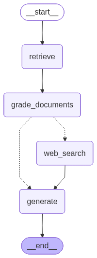

# Corrective RAG (CRAG) with LangGraph

A Corrective Retrieval-Augmented Generation pipeline built with [LangGraph](https://langchain-ai.github.io/langgraph/). The graph retrieves documents from a local vector store, **grades each document for relevance**, and falls back to a **live web search** (Tavily) whenever the retrieved context isn't good enough — before generating an answer.

## Architecture

The pipeline is modeled as a state graph:



| Node | Responsibility |
| --- | --- |
| `retrieve` | Embed the question and pull the top matching chunks from the Chroma vector store. |
| `grade_documents` | Score each retrieved chunk as relevant (`yes`) or not (`no`). If any chunk is dropped, flag a web search. |
| `web_search` | Query Tavily for fresh results and append them to the context (only when the relevance grade triggered it). |
| `generate` | Produce the final answer from the question + (corrected) context. |

**Flow:** `retrieve → grade_documents → (web_search | generate) → generate → END`

The conditional edge after grading is decided by `decide_to_generate`: if the `web_search` flag is set, the graph routes through `web_search` first; otherwise it goes straight to `generate`.

## Project layout

```
.
├── ingestion.py              # Loads source URLs, chunks them, builds/loads the Chroma store + retriever
├── main.py                   # CLI entry point — asks a question and runs the graph
├── graph/
│   ├── graph.py              # Graph wiring, conditional edges, compiles `app`, renders graph.png
│   ├── consts.py             # Node name constants
│   ├── state.py              # GraphState (question, generation, web_search, documents)
│   ├── nodes/                # retrieve, grade_documents, web_search, generate
│   └── chains/               # retrieval_grader + generation chains (+ tests)
└── graph.png                 # Rendered graph diagram (regenerated on each run of graph.py)
```

## Prerequisites

- Python **3.12+**
- [`uv`](https://docs.astral.sh/uv/) for dependency management
- API keys for **OpenAI** and **Tavily** (and optionally **LangSmith** for tracing)

## Setup

```bash
# 1. Install dependencies
uv sync

# 2. Configure environment variables (see below)
cp .env .env.local   # then fill in your keys
```

Create a `.env.local` (loaded with `override=True`) with:

```dotenv
OPENAI_API_KEY=sk-...
TAVILY_API_KEY=tvly-...

# Optional — LangSmith tracing
LANGCHAIN_TRACING_V2=true
LANGCHAIN_API_KEY=ls-...
LANGCHAIN_PROJECT=corrective-rag
```

## Ingestion (build the vector store)

The Chroma store is persisted to `./.chroma`. The first time, uncomment the `Chroma.from_documents(...)` block in `ingestion.py` to build and persist the embeddings, then re-comment it so subsequent runs just load the existing store:

```python
vector_store = Chroma.from_documents(
    documents=doc_splits,
    collection_name='rag-chroma',
    embedding=OpenAIEmbeddings(),
    persist_directory='./.chroma'
)
```

> ⚠️ Run the ingestion block **only once** per source set — running `from_documents` repeatedly appends duplicate chunks to the persisted collection.

## Running

```bash
uv run python main.py
```

You'll be prompted for a question (the corpus is about LLM agents, prompt engineering, and adversarial attacks). The console prints each node as it executes (`###Retrieving###`, `### GRADE DOCUMENTS ###`, etc.) and finishes with the final state including the `generation`.

## Tests

```bash
uv run pytest
```

The suite (`graph/chains/tests/test_chains.py`) checks:
- a relevant document grades `yes`
- an off-topic question grades `no`
- the generation chain answers on-topic

## Tech stack

- **LangGraph** — stateful graph orchestration
- **LangChain + langchain-openai** — LLM chains and structured grading output
- **Chroma** — local persistent vector store
- **OpenAI embeddings** — document/query embeddings
- **Tavily** — live web search fallback
- **uv** — packaging and environment management
